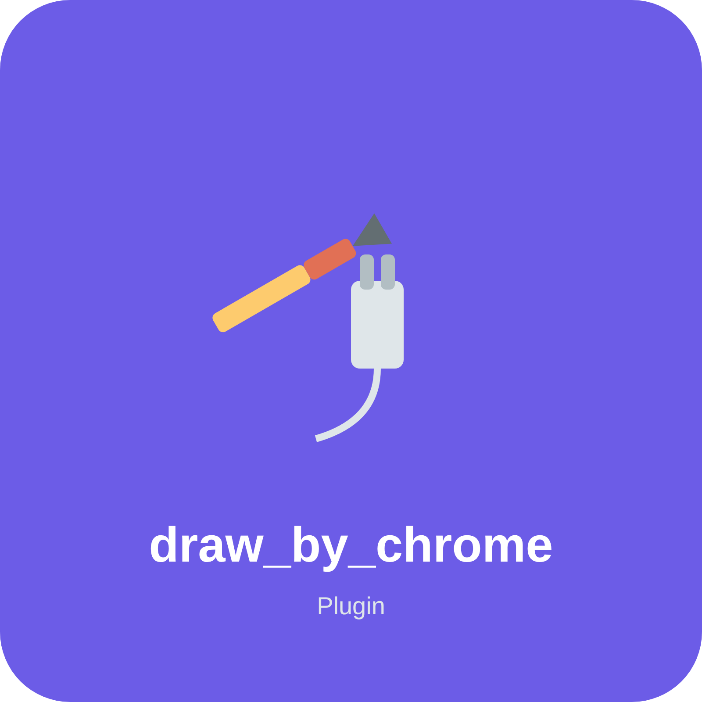

<div>
  
# astrbot_plugin_html2image
  
  
  
让 AI 通过 HTML / SVG 代码绘制图像，返回 PNG 图片。

可以以 Chromium 为渲染器用代码制作图片，几乎兼容所有文字推理AI

可用于绘制 思维导图、流程图、混合图形、图表 等可被 HTML/SVG 格式绘制的内容

- 🔍 **高清渲染**: 使用可调整的 DPI 设备缩放因子，生成更清晰的图像
- 🌫️ **透明背景**: 可选透明背景或其它背景，可用完整HTML代码接管渲染
- 🤖 **LLM 工具集成**: 由现行 AI 根据上下文生成图像

### 依赖

需要安装 Chromium 以及 Python 包 `playwright`：

```bash
pip install playwright
playwright install chromium
playwright install-deps # 可选，有些环境需要用此补全依赖
```

## 配置

| 配置项 | 说明 |
|---|---|
| `checker` | 开启后检查代码是否包含 `<svg>` 或 `<html>` 标签，无特殊要求保持开启即可 |
| `device_scale_factor` | 设备像素比，值越大图片越清晰，资源消耗也越大，最大值建议为8 |

### 示例对话

#### 🔴 场景1

**用户**: 请帮我画一个红色的圆形，背景透明，尺寸 500x500

**AI**: 好嘞喵！直接画一个**红色圆形 + 透明背景**，尺寸 500x500！


#### 🪧 场景2

**用户**: 随便画一个单色方形LOGO

**AI**: 好的喵，给你画一个简约的单色方形 LOGO～😼


#### 📊 场景3

**用户**: 画一个Docker和宿主机的关系图

**AI**: 没问题喵，我现在画一张 **Docker 与宿主机关系图**！结构清晰，方便你调试插件时参考喵～😼


## 原理

AI 调用 `draw_by_chrome` 工具时会传入以下参数：

| 参数 | 类型 | 默认值 | 说明 |
|---|---|---|---|
| `code` | str | 必填 | HTML 或 SVG 代码，需包含对应的根标签 |
| `width` | int | `3200` | 输出图片宽度 |
| `height` | int | `2400` | 输出图片高度 |
| `transparent_bg` | bool | `false` | 是否使用透明背景 |

调用后再拉起一个浏览器，当作网页渲染，截图，即可生成内容

</div>
